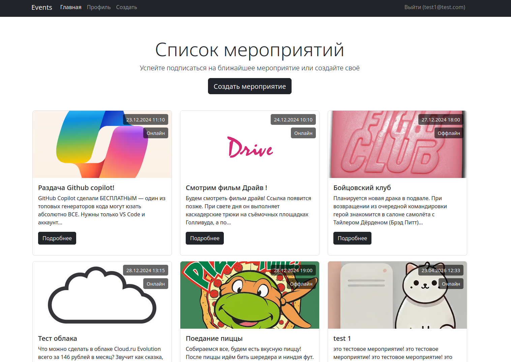

# Event Manager Web Application

[View Russian version](README.ru.md)

[](https://opensource.org/licenses/MIT)

## Description
Web application for event publishing and registration (coursework project).


## Technologies
- Docker
- PHP 8.2
- MySQL 8.4
- Nginx
- Yii Framework

## Requirements
- Docker >= 20.10
- Docker Compose >= 1.29

## Installation
1. Clone repository:
```bash
git clone https://github.com/yourusername/web-course.git
cd web-course
```

2. Create environment:
```bash
make env  # создаст .env из примера
```

3. Installation:
```bash
make install  # запуск контейнеров и установка зависимостей
```

## Usage
Makefile commands:
```makefile
up       # Запуск контейнеров
down     # Остановка контейнеров
migrate  # Применить миграции БД
```

web app url: http://localhost:8080

## Application structure
```
├── docker-compose.yaml
├── Makefile
├── .env.example
└── web/            # Веб-корень
```

## Additional information
This project is a term paper and was created for educational purposes.